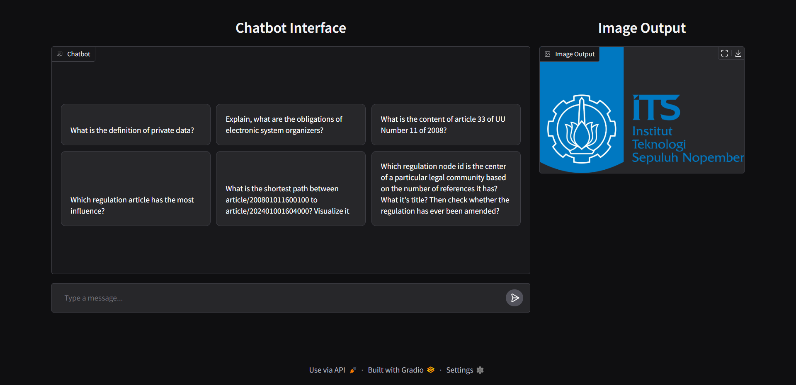

## Next-Gen Indonesia IT Law Q&A: Knowledge Graphs & LLMs
Information Systems Department, Institut Teknologi Sepuluh Nopember, Surabaya, Indonesia.

<br>



## Inspiration
Understanding Indonesia's IT laws can be complex due to the vast number of regulations, articles, and interconnections. By leveraging **Retrieval-Augmented Generation (RAG)**, **Large Language Models (LLMs)**, and **Knowledge Graphs**, we aim to provide a smarter, context-aware **Q&A system** that enables legal professionals, researchers, and policymakers to retrieve precise legal insights efficiently.

## What it does
This system allows users to:
- Perform **AQL (ArangoDB Query Language)** and **semantic searches** across 63 Indonesia IT law regulations.
- Identify **the most influential regulations** and explore their relationships.
- Analyze **connections between regulations and articles** using graph-based analytics.
- Visualize legal structures with **matplotlib** for better understanding.

## Installation
To install the latest version of this code, please use this following command.
1. Git clone this project to the local computer
    ```shell
    git clone https://github.com/bayu-siddhi/graph-rag-arangodb
    cd graph-rag-arangodb
    ```

2. Create a virtual environment (optional but recommended):.
    ```shell
    python -m venv venv
    source venv/bin/activate  # on Windows: venv\Scripts\activate
    ```

3. Install all the project dependencies.
    ```shell
    pip install -r requirements.txt
    ```

4. Copy the environment configuration.
    ```shell
    cp .env.example .env
    ```

5. Run the Gradio app on the [`main.py`](main.py) file.
    ```shell
    python main.py
    ```
    Or see the development process in [`notebook.ipynb`](notebook.ipynb).

> [!NOTE]
> - This project was developed using `python==3.11.4`, see [requirements.txt](requirements.txt) for dependencies details.
> - Edit the `.env` file and fill in your ArangoDB credentials and other necessary configuration.
> - Make sure ArangoDB is running and that the user has Administrate privileges.

## How we built it  
1. **Knowledge Graph Construction:**  
   - Built using **ArangoDB** with **63 regulations**, **2,423 articles**, and over **7,500 relationships** including amendments, references, and hierarchical structures.
2. **Graph Analytics:**
   - Integrated **NetworkX** to analyze **shortest paths, centrality, and community structures**.
3. **Natural Language Processing:**
   - Utilized **RAG with LLMs** to provide **context-aware responses** based on graph retrieval.
4. **User Interface:**
   - Developed with **Gradio**, running locally at `http://127.0.0.1:7861`.

## Challenges we ran into
- Efficiently indexing and querying **large-scale legal documents** while maintaining response speed.
- Integrating **graph-based retrieval** with **LLM-generated** responses.
- Designing an intuitive **legal Q&A interface** for non-technical users.

## Accomplishments that we're proud of
- Successfully **integrated ArangoDB, NetworkX, and LLMs** for **graph-enhanced legal Q&A**.
- Enabled **advanced legal reasoning** by mapping the **impact and references** between laws.
- Built **an interactive visualization** that helps users **see legal connections dynamically**.

## What we learned
- The power of **RAG and LLMs** in **legal document retrieval**.
- How **knowledge graphs enhance Q&A accuracy** by structuring unstructured data.
- The importance of **graph analytics in legal research**, especially in identifying key regulatory influences.

## What's next for Next-Gen Indonesia IT Law Q&A: Knowledge Graphs & LLMs
- Expanding the dataset to include **more legal domains beyond IT law**.
- Enhancing **real-time graph analytics** for deeper legal insights.
- Deploying the system as **a cloud-based API** for broader accessibility.
- Improving **natural language understanding** to support **multi-turn legal conversations**.

<br><br>
<div align="center">
  <image src="assets/ITS-logo.png", width=250, alt="Institut Teknologi Sepuluh Nopember Logo">
</div>
